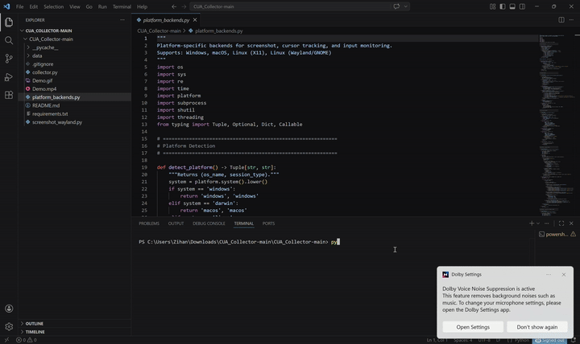

# CUA_Collector




`CUA_Collector` is a lightweight desktop data collection tool for Computer Use Agent workflows. It records UI interaction traces as paired screenshots around each user action:

- `State_A`: screenshot before the action
- `Action`: click, drag, scroll, or hotkey event with coordinates, timing, and metadata
- `State_B`: screenshot after the action

The output is useful for building datasets for UI automation, behavior cloning, and action prediction experiments.

## Quick Start

```bash
git clone <repo-url>
cd CUA_Collector

# One-command setup (installs everything)
bash setup.sh

# Log out and log back in (required for Wayland)

# Run
source .venv/bin/activate
python collector.py
```

## Full Setup Guide

### Prerequisites

| Component | Purpose | Install |
|-----------|---------|---------|
| Python 3.10+ | Runtime | `sudo apt install python3 python3-venv` |
| gjs | Wayland screenshot helper (GStreamer + PipeWire) | `sudo apt install gjs` |
| GStreamer + PipeWire | Screen capture on Wayland | `sudo apt install gstreamer1.0-pipewire gstreamer1.0-plugins-base` |
| evdev | Keyboard/mouse input on Wayland | `pip install evdev` (+ `input` group) |
| pynput | Keyboard/mouse input on X11/Windows/macOS | `pip install pynput` |

### Step 1: Install dependencies

```bash
# System packages (Ubuntu/Debian)
sudo apt install python3 python3-venv gjs \
  gstreamer1.0-pipewire gstreamer1.0-plugins-base gstreamer1.0-plugins-good \
  pipewire xdg-desktop-portal xdg-desktop-portal-gnome

# Python packages
python3 -m venv .venv
source .venv/bin/activate
pip install -r requirements.txt
```

### Step 2: Input device permissions (Linux)

On Linux, the collector reads raw input events via `evdev`. Your user must be in the `input` group:

```bash
sudo usermod -aG input $USER
# Log out and log back in for this to take effect
```

Verify: `groups | grep input`

### Step 3: Cursor tracker extension (Wayland GNOME only)

On Wayland, applications cannot read global cursor position (security model). Neither `pynput` nor GNOME's `Shell.Eval` D-Bus work on GNOME 45+.

We solve this with a tiny GNOME Shell extension that exposes `global.get_pointer()` over D-Bus:

```bash
# Automated install
bash setup_extension.sh

# Or use the full setup script which does everything
bash setup.sh
```

**After installing, you MUST log out and log back in** for GNOME Shell to discover and load the extension.

Verify it works:
```bash
gdbus call --session \
  --dest org.cua.CursorTracker \
  --object-path /org/cua/CursorTracker \
  --method org.cua.CursorTracker.GetPosition
# Expected: (1234, 567) — your actual cursor coordinates
```

> **Note:** This step is only needed on Wayland GNOME (Ubuntu 22.04+, Fedora 38+, etc.). X11, Windows, and macOS use pynput which works natively.

### Step 4: Run

```bash
source .venv/bin/activate
python collector.py
```

Optional flags:
```bash
python collector.py --data-dir ./data --debounce 0.5
```

## Usage

### Hotkeys

| Hotkey | Action |
|--------|--------|
| `Ctrl+F8` | Start a new task (opens description dialog) |
| `Ctrl+F9` | Take pre-screenshot, begin listening for action |
| `Ctrl+F12` | End current task |
| `Esc` | Cancel/drop current pending action |
| `Ctrl+C` | Quit collector |

### Workflow

1. **Start task** (`Ctrl+F8`) → enter a description → auto-takes first pre-screenshot
2. **Perform action** → click, drag, scroll, or press modifier keys
3. **Auto-capture** → 0.5s after you stop, post-screenshot is taken automatically
4. **Next action** → press `Ctrl+F9` for the next action cycle
5. **End task** (`Ctrl+F12`) → saves all data

### Recorded Actions

The collector tracks:

| Action Type | What's Recorded |
|-------------|-----------------|
| **Click** | Button (left/middle/right), press coords, release coords, press/release timestamps, delta_time |
| **Drag** | Same as click but detected when release coords differ from press coords (>3px) or hold time >0.3s |
| **Scroll** | Accumulated dx/dy totals, direction |
| **Hotkey** | Special key press/release (Ctrl, Shift, Esc, Backspace, Enter), timestamps, delta_time |

All mouse buttons (left, middle, right) record full press→release cycles with coordinates at both events. Modifier keys record hold duration so downstream models can reconstruct compound actions like `Ctrl+Click` or `Shift+Drag`.

## Output Format

```
data/
  index.json              ← summary of all tasks
  <task_id>/
    task.json             ← task metadata + ordered action list
    screenshots/
      action_0001_before.png
      action_0001_after.png
      ...
```

### Action Record Schema

```json
{
  "action_type": "click | drag | scroll | hotkey",
  "action_coords": [x, y],
  "action_details": {
    "mouse": [
      {
        "button": "left",
        "press_coords": [100, 200],
        "release_coords": [100, 200],
        "press_time": "2026-04-01T22:08:59Z",
        "release_time": "2026-04-01T22:09:00Z",
        "delta_time": 0.12
      }
    ],
    "keys": [
      {
        "key": "ctrl_l",
        "press_time": "...",
        "release_time": "...",
        "delta_time": 0.5
      }
    ],
    "scroll": {
      "dx_total": 0,
      "dy_total": -3,
      "direction": "down"
    }
  }
}
```

## Repository Layout

```
collector.py             Main entrypoint and state machine
platform_backends.py     Platform-specific screenshot, cursor, and input backends
screenshot_wayland.py    PipeWire screencast capture for Wayland
setup.sh                 Full system setup script
setup_extension.sh       GNOME cursor-tracker extension installer
requirements.txt         Python dependencies
data/                    Collected output (git-ignored)
```

## Platform Support

| Platform | Screenshot | Cursor Tracking | Input Monitoring |
|----------|-----------|-----------------|------------------|
| Linux (Wayland GNOME) | PipeWire ScreenCast | cursor-tracker@cua extension | evdev |
| Linux (X11) | mss | pynput | pynput |
| macOS | mss | pynput | pynput |
| Windows | mss | pynput | pynput |

## Troubleshooting

### Cursor position always the same on Wayland

The GNOME cursor-tracker extension is not active. Run `bash setup_extension.sh`, then **log out and log back in**.

### "Permission denied" reading input devices

Your user is not in the `input` group. Run `sudo usermod -aG input $USER`, then **log out and log back in**.

### Screenshot shows share dialog on first run

This is expected on Wayland. Click "Share" once — the permission is persisted for future runs (`persist_mode=2`).

### Screenshot fails silently

Ensure `gjs`, `gstreamer1.0-pipewire`, and `pipewire` are installed: `sudo apt install gjs gstreamer1.0-pipewire pipewire`.

## Citation

```bibtex
@misc{dong2026cuacollector,
  author = {Zihan Dong},
  title = {CUA_Collector},
  year = {2026},
  note = {Computer Use Agent behavior collection demo}
}
```

## License

Commercial Use: let's discuss by puma122707@gmail.com.

Non-Commercial Use: free.

Research Use: free.
